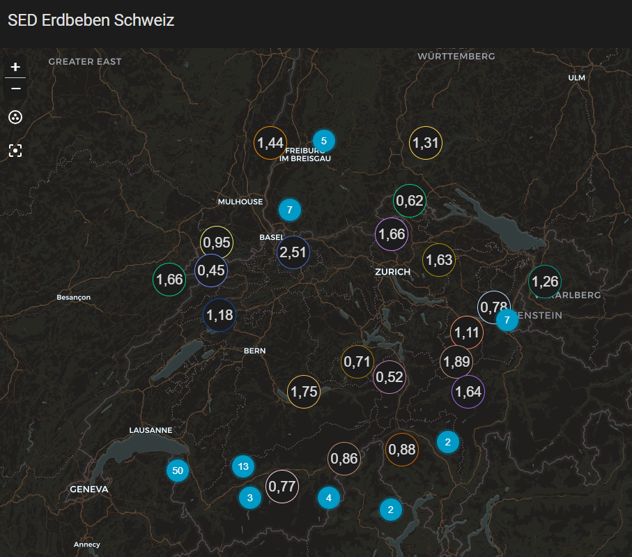

# Swiss Earthquakes (SED)

[](https://github.com/hacs/integration)
[](LICENSE)
[](https://www.buymeacoffee.com/prusuino)

A Home Assistant custom integration that shows recent Swiss earthquakes on a map, sourced from the **Swiss Seismological Service (SED, ETH Zurich)**.



## Background

The SED operates a public **FDSN Event Web Service** — the same standardized protocol used by seismological networks worldwide — with no authentication required. This integration queries it for earthquakes within a configurable radius, time window, and minimum magnitude around a location, and turns each one into a `geo_location` entity.

Home Assistant's `geo_location` platform is designed exactly for this: entities with coordinates automatically show up as markers on any Map card — no custom card needed. Entities appear and disappear on their own as new earthquakes occur and old ones age out of the configured time window.

**Note on coverage:** the SED runs its own regional monitoring network (~150 stations) in and around Switzerland. Even with a very large radius configured, you will only see earthquakes from Switzerland and its immediate border regions — that's the actual extent of the SED's own catalog, not a limitation of this integration.

Quarry blasts (which the raw feed also contains) are filtered out server-side (`eventtype=earthquake`).

## What it provides

| Entity | Description |
|---|---|
| `geo_location.earthquake_<magnitude>_<place>` | One per currently tracked earthquake. State = distance from your configured location (km). Attributes: magnitude, magnitude type, depth (km), timestamp, place. Shows up automatically on any Map card. |
| `sensor.sed_earthquakes_count_<radius>km` | Count of earthquakes currently within the configured radius/time window/magnitude threshold. Attribute `strongest_quake` holds the strongest currently tracked event; attribute `magnitude_scale` is a plain-language reference for what different magnitude ranges typically mean (see below). |
| `sensor.sed_earthquakes_latest_<radius>km` | Timestamp of the most recent earthquake (`device_class: timestamp`) — reliably fires a state-changed trigger whenever a new earthquake appears. Attributes: magnitude, magnitude type, depth, place, distance, event ID. |

Data is refreshed every 10 minutes.

## Language

Entity names, the device name/manufacturer/model, the auto-generated dashboard, and the config flow adapt automatically to your Home Assistant language setting — German, English, French, and Italian are supported, with English as the fallback for any other language.

### Magnitude scale

`sensor.sed_earthquakes_count_<radius>km` carries a `magnitude_scale` attribute with a rough, SED-sourced orientation of what different magnitudes typically mean in Switzerland (localized to your HA language):

| Magnitude | Typical effect |
|---|---|
| < 2.5 | Not felt, only recorded by seismometers |
| 2.5 – 4.0 | Felt by people near the epicenter, usually no damage |
| 4.0 – 4.5 | Isolated minor damage near the epicenter possible (e.g. cracked plaster) |
| 4.5 – 5.5 | Minor damage to individual buildings likely, rarely more serious damage |
| > 5.5 | Historically rare in Switzerland (e.g. Basel 1356, M~6.6) — can cause significant damage |

This is a rough orientation, not a prediction — actual effects depend heavily on depth, distance to the epicenter, and local subsoil. Source: [SED magnitude FAQ](https://www.seismo.ethz.ch/en/knowledge/faq/what-does-magnitude-mean/).

## Installation

### HACS (recommended)

1. In HACS, go to **Integrations → ⋮ → Custom repositories**, add this repository URL with category **Integration**.
2. Search for **"Swiss Earthquakes"** and install.
3. Restart Home Assistant.

### Manual

1. Copy the `custom_components/sed_earthquakes` folder into your Home Assistant `config/custom_components/` directory.
2. Restart Home Assistant.

## Setup

1. Go to **Settings → Devices & Services → Add Integration**.
2. Search for **"Swiss Earthquakes (SED)"**.
3. Latitude/longitude default to your Home Assistant home location. Set the radius (km), minimum magnitude, and time window (days) to your preference.
4. Done. Add the integration again for a different location or radius — each instance is independent.

### Automatic dashboard

On first setup, the integration automatically creates an **"Earthquakes Switzerland"** dashboard (shown in the sidebar, title localized to your HA language) with a full-screen native Home Assistant Map card, already configured to display each earthquake's magnitude directly on its marker (via the map card's built-in `label_mode: attribute` option — no custom card, no extra HACS dependency). This only happens once: if you later customize or delete that dashboard yourself, the integration won't touch it again.

If you prefer to build your own map card instead, the native Map card supports magnitude labels out of the box:

```yaml
type: map
geo_location_sources:
  - source: sed_earthquakes
    label_mode: attribute
    attribute: magnitude
```

## Notes

- Switzerland has continuous low-level background seismicity — with the default settings (150 km, magnitude ≥ 0, 30 days) you'll typically see dozens of entities, mostly very small (M<1) events. Raise the minimum magnitude if you only want noticeable events.
- This integration is unofficial and not affiliated with, endorsed by, or supported by the SED or ETH Zurich. It only reads their published data via the standard FDSN protocol.
- If the FDSN service is unreachable, entities simply stop updating rather than showing incorrect data.

## Data source & license

This integration reads live data from the SED's public FDSN Event Web Service. Citing the source is required whenever this data is displayed — see [NOTICE.md](NOTICE.md) for details. Every entity sets Home Assistant's `attribution` attribute accordingly.

## Disclaimer

This integration is provided **as-is, without any warranty**. Data is retrieved from a third-party published source and may be inaccurate, delayed, incomplete, or unavailable — earthquake parameters (location, time, magnitude) for very recent events are often only automatically determined and can change after manual review by the SED. Do not rely on this integration for safety-critical decisions. The author(s) accept **no responsibility or liability** for any damage, loss, incorrect readings, or other issues arising from using this integration, whether it stops working, behaves unexpectedly, or never worked correctly for your setup in the first place.

## License

Source code: MIT — see [LICENSE](LICENSE). Earthquake data: see [NOTICE.md](NOTICE.md) for the SED's attribution requirement.

## Support

If this integration is useful to you, you can support its development:

<a href="https://www.buymeacoffee.com/prusuino"></a>
